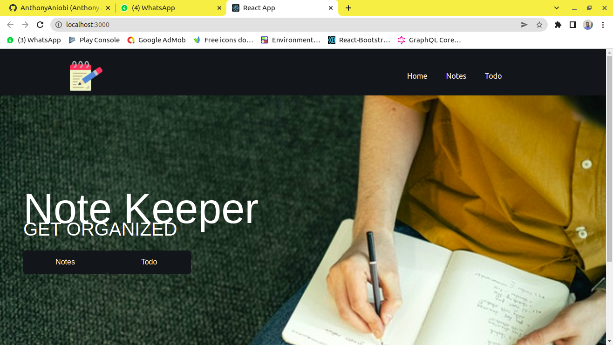
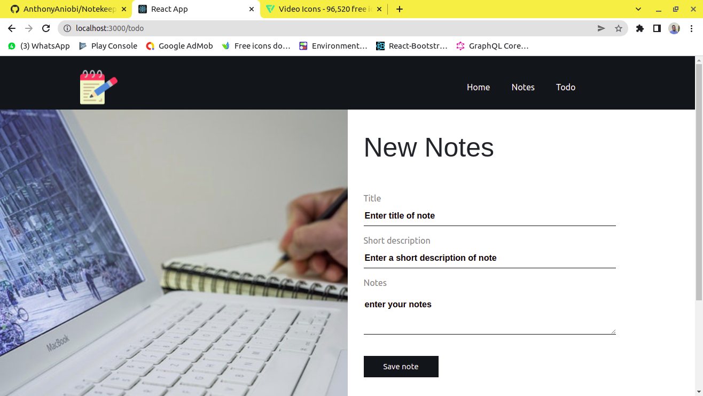
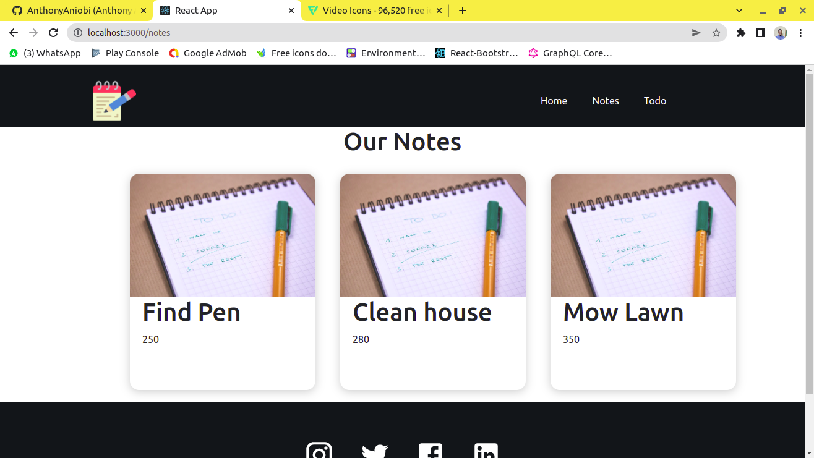

# Notekeeping app

## A react project for storing and retrieving notes

This application helps to  write notes and have them persist on the device. It also alarms the user when the time for a schedule is due

#### screenshots

#### libraries used
- react-bootstrap
- react-router-dom

##### Attributions
- Icon image by [Smashicons - Flaticon](https://www.flaticon.com/free-icons/notes)
- Edit Image by [mali maeder - Pexels](https://www.pexels.com/photo/close-up-of-man-using-mobile-phone-246658/)
- Home image by [Ivan Samkov - Pexels](https://www.pexels.com/photo/person-writing-on-a-notebook-4238524/)
- To do image by [freestocks.org - Pexels](https://www.pexels.com/photo/orange-and-green-pen-on-graphing-notepad-131979/)
- Notes image by [Pixabay](https://www.pexels.com/photo/blank-book-pages-desk-green-531844/)
